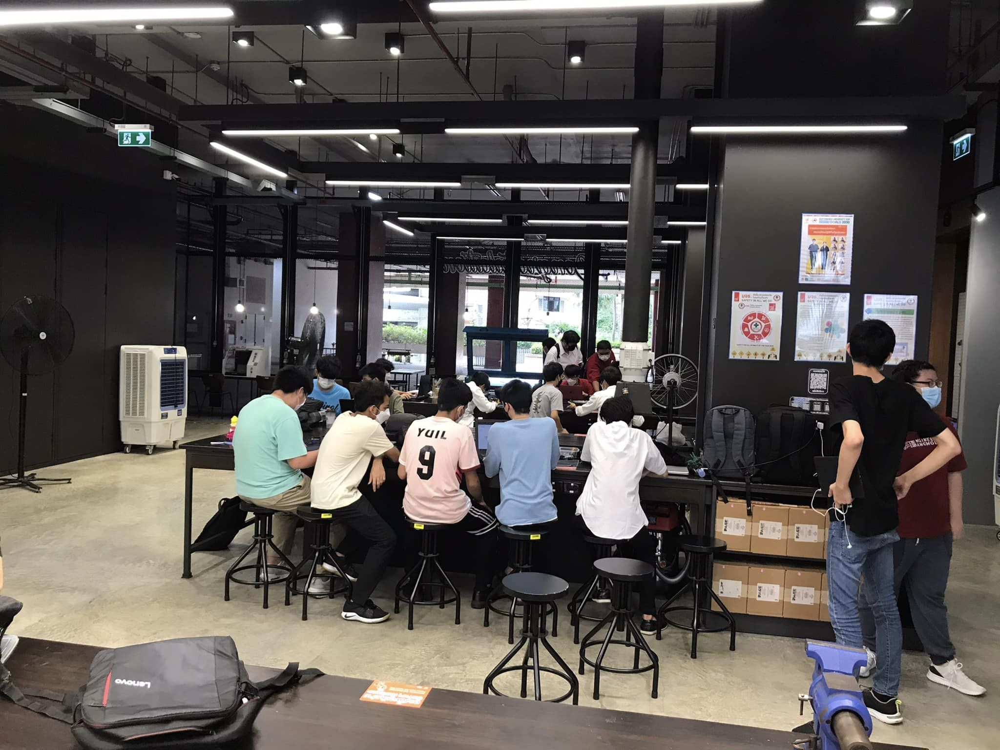

# Week 12 - Cyber Security

November 11, 2022

Date: 2022-11-11 09:39

Event: Classroom lecture

We discussed the basics of cyber security, current developments, and safety measures in this session, followed by a CTF game where we got a chance to explore web application vulnerability patterns.

## Coursework (the 'what?') 🤷‍♂️

The protection of computer systems and networks from information disclosure, theft, or damage to our essential systems and sensitive information from cyberattacks is known as computer security, or cybersecurity, which is something we learned about this week.

In order to be able to stop a hack from being committed by hackers and other anonymous users who attempted to interact with the internal system, we researched the significance of cybersecurity and penetration testing.

### CIA Triad

The CIA triad is an information security model made up of the three main components of confidentiality, integrity, and availability. It is used to guide organizations in maintaining a secure information system by ensuring that all three components are addressed.

* **Confidentiality** refers to ensuring that only authorized users can access sensitive information.
* **Integrity** refers to ensuring that data is accurate and reliable.
* **Availability** refers to ensuring that data and systems are accessible when needed by authorized users.

<figure><figcaption>
source: <a href="https://www.bahi-hussein.com/what-is-the-cia-triad/">https://www.bahi-hussein.com/what-is-the-cia-triad/</a>
</figcaption></figure>

## Current cyber crimes development (focused in the ASEAN region)

We also looked into the various people and approaches that could pose a cyber threat. As an illustration, consider **phishing** websites that masquerade as the official websites of well-known corporations but are actually just imitations of legitimate corporate websites. Users may mistakenly believe they are using a real website and enter their login information on the phony one. In the end, the login information is handed to hackers, who then have access to user accounts.

Following is a list of potential threat actors as per the lecture: criminals, government, terrorists, employees, contractors, whistleblowers, and so on.

We must strive to avoid clicking on URLs that automatically redirect, and we must always scan USB drives before connecting them to our digital devices in order to prevent someone from infecting our computer system with malware or a virus.

## Impact (the 'so what?') 🚀

Cybersecurity is important because it helps protect organizations, businesses, and individuals from malicious attacks that could compromise their sensitive data and personal information. Cybersecurity is also important to protect networks and systems from unauthorized access, disruptions, or modifications that can compromise the confidentiality, integrity, and availability of data and systems.

As more organizations rely on digital networks and systems to store and send information, cybersecurity is becoming more and more crucial. Organizations may defend their data and users from thieves, hackers, and other nefarious actors by maintaining the security of these networks and systems.

## Reflections (the 'now what?') 🤔

We used the website hackthissite.com to test our understanding of cyber security. This website serves as an example of penetration testing, and it's a great way to discover how hackers employ techniques to evaluate system penetration before actual hacks take place. So, learning how to hack is undoubtedly one of the best skills that every IT specialist should have.

## Further reading (optional) 📄

### Keynotes 📝

> * CIA triad
> * Cyber threat (def. by Thai law)
>   * Trends in Thailand
>     * Internet usage trend
>       * Digital growth (+4% growth internet users) - 192 million while total population growth is just +1%
>       * 77% internet adoption rate
>       * avg. thai spends about 9 hours a day (src.: we are social, hootsuite)
>       * avg. thai spends about 5 hours a day (prefer spending on mobile)
>     * Threat samples
>       * Traditional phone scams Call victim pretending to be a security official and persuade them to follow instructions in another language they don't know. Finally, the victim may transfer whole balance into malicious account.
>       * Call center sams (in Thailand)
>         * Using intimidation, pressure, and scare to make sure that victims will follow every process of scamming
>         * Operating from overseas
>         * Using other countries or orther people phone numbers and luring victims to transfer money to fake bank account
>         * Technology:
>           * IP PBX - call using VOIP (IP private branch exchange)
>           * SIM pool (in IP PBX box) - can make 10,000 callsin our
>           * Wireless router
>         * Techniques:
>           * Instruction manual for phone calls by charts and ready made manuals (src: Scam call centers busted in cambodia - NBT world)
>           * Chinese scammers: even use Team Viewer (ask victim to install this) and persuade to cooperate
>     * Action taken by government
>       * What DSI (Thai FBI) did to fight against the scams? Prepared a propaganda awareness music video and distribute it via CD (telling not to give money on calls)
> * Threat sources:
>   * Personal (whistleblower, B2C custoomer, criminal, ethical hacker, hacker(s), fomer employee, employee)
>   * Organizational (contractor, competitor (rival in business), )
>   * State agencies (government, terrorist, )
>   * **Clashing between 'sword' and 'shield',** => the real world might have day and night, but cyber world never sleeps.
>   * A few things to remember:
>     * We are building fences, not walls
>     * You can lock the door, but it is not good if the windows is open
>     * A secure system is only _as strong as its weakest link_
>     * And that could be you
> * Types of cyber threat
>   * Cyber crime - _crime involving computer and computer network_
>     * Phishing attack (pretending as banking website)
>   * Hactivism - _to promote social change or political agenda using technology_
>     * examples of hacktivist movements: OpSingleGateway, NoToCsensorship, Anonymous, Expect US
>     * like: persuading 50k user to hit a website and freeze it (DDOS attack) to protest against a new parliament bill
>   * Cyber terrorism - _motivated use of computers_
>   * Cyber warfars
> * Importance of your Citizen ID card?
>   * Don't post back of Citizen ID card
>   * And don't post online:
>     * attackers can use it to take your government service benefits
>     * or people can use to make victim database for scams
>   * Government agency website need only ID number: to check farmer status and check your voting rights
> * Dealing with cyber therat with cyber security awareness
>   * Good behaviour will keep you sage from cyber threats.
>     * Don't stick password on desktop (wallpaper, sticky notes) Case study: Hawaii emergency agency password on post-it note
>     * Password managers please.
>     * Don't let others know your password.
>     * Don't use commonly used passwords.
>     * Good password guidelines.
>       * use pass phrase is better.
>       * type in english keyboard but using Thai keyboard layout and Thai word - use translation in romanized form (be mindful when using smartphone)
>       * https://howsecureismypassword.net/ moved to https://www.security.org/how-secure-is-my-password/ or Bitwarden password test
>     * Scan peripherals for malwares and passwords.
>     * Accessing risky websites.
>       * validate authentic websites using their certificates
>     * Pirated software (6 months to 4 year jails & 100,000 to 800,000 THB of penalty by Thai law for using Pirated software)
>   * We need you!
>     * carry out research to come upwith systematic countermeasure, with security frameworks and infrastructures
>     * develop cyber security professionals
> * **Penetration testing**
>   * \[\[image-20221111111952120.png]]
>   * white vs grey vs black
>     * white: follow corporate rules (like NDA) and compliance with the law
>     * gray: perception of right vs wrong over what the law has to say
>     * black: fully dope!!!
>   * example work: https://hackthissite.org/
>
> #### Resources 🎁
>
> The additional resources provided in the class were osboxes.org website, Parrot 7zipped ISO file, setup for Oracle Virtualbox, and Ubuntu ova file (open virtualization format archive).
