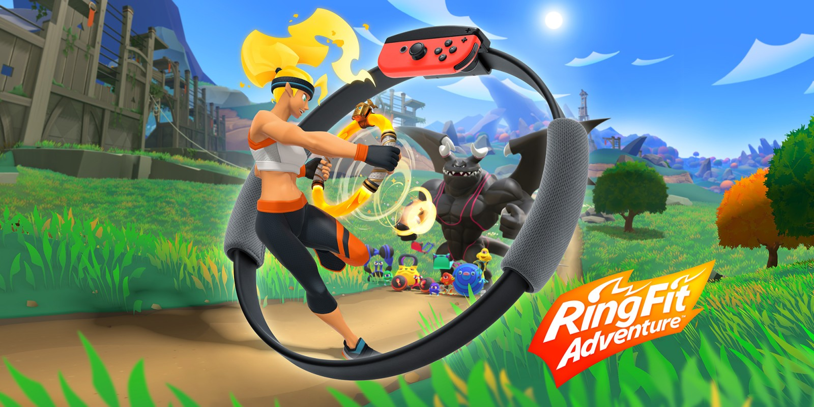

# Week 9 - Project 1 (Gambler Bot)

October 21, 2022

## A brief introduction (the 'what?') 🤷‍♂️

On this day, we had to finish creating the robot that could pick many dice off the ground, gather them, and then place them in the middle. The title of the article is "gambler robot." This week's session is unique because we had to showcase our robot designs and compete to see who could carry the most dice while moving toward the center.

Before arriving on that day, we had constructed the robot with six members and talked about every step of the process, from the design prototype to the finished model. I discovered during the process how important communication and understanding between parties are. We discussed our ideas, options, and thoughts.

## Impact (the 'so what?') 🚀

It's an extremely difficult competition, and I learned a ton about myself in the process. I have experience finishing the final job with teammates because I had to engage in the process with them. We had to work out the steps till everyone was in agreement because it was really enjoyable and everyone had their own thoughts.

Given that our group is made up of both Thai and international students, this little project may prove to be a little difficult for all of the participants. But nevertheless, we were able to improvise team members' communication skills.

## Reflections (the 'now what?') 🤔

I now have more information about making machines and robots, and I am better prepared should I ever get the chance to make another one in the future. Every student in the engineering field should be familiar with the fundamentals of a machine.

Also, we acquired the honesty and commitment necessary to establish this business, and I may use these in future situations.

## Further reading 📄

I've realized a few benefits of working on a group project at a university during my freshmen year.

* **Develop Teamwork Skills:** Working on a group project requires students to work collaboratively in order to successfully complete the task. This provides a great opportunity to develop important teamwork skills such as communication, problem-solving, and conflict resolution.
* **Enhance Time Management Skills**: Group projects also provide an ideal platform for students to develop their time-management skills. They must learn to balance the workload of the group and divide the tasks accordingly so that the project can be completed on time. 3
* **Increase Creative Thinking**: Working in a group encourages students to think outside the box and come up with creative solutions to the task at hand. This helps them to develop their critical thinking skills and apply them to future projects.
* **Learn How to Take Initiative**: Group projects also provide students with the opportunity to take initiative and lead the group. This helps them to become more confident and responsible in taking on tasks and completing them successfully.
* **Develop Leadership Skills**: Working on a group project also provides an opportunity for students to practice their leadership skills. Group members can take turns leading the discussion, brainstorming, and delegating tasks, which helps them to develop their leadership capabilities.

.png>).png>)

Some glimpses of working on Gambler bot and collection of peer's project work (last picture). (source: INNO-X KMUTT and CPE101 KMUTT social handles)

### References:

INEX Educational Kit

<figure><figcaption>
source: <a href="http://www.inexglobal.com/products.php?pcode=ibitrobotkit&#x26;type=educationalkit">http://www.inexglobal.com/products.php?pcode=ibitrobotkit&#x26;type=educationalkit</a>
</figcaption></figure>

* [http://www.inexglobal.com/products.php?pcode=ibitrobotkit\&type=educationalkit](http://www.inexglobal.com/products.php?pcode=ibitrobotkit\&type=educationalkit)
